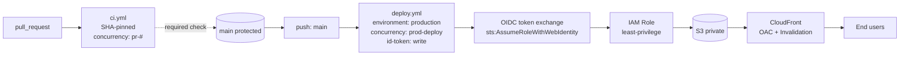

# End-of-Enterprise pipeline

- PR-triggered `ci.yml` pins every action to a commit SHA, runs under PR-keyed concurrency that cancels superseded runs
- Branch protection on `main` requires the `build` check to pass before merge
- Push to `main` runs `deploy.yml` against the `production` environment (required reviewers + wait timer), under a queued non-cancelling `prod-deploy` concurrency group
- `id-token: write` lets the runner request a GitHub OIDC token; `sts:AssumeRoleWithWebIdentity` exchanges it for short-lived AWS credentials on a least-privilege IAM role
- Role pushes the artifact to a private S3 bucket and invalidates CloudFront
- CloudFront with Origin Access Control fronts the bucket — end users hit the CDN, never S3 directly
