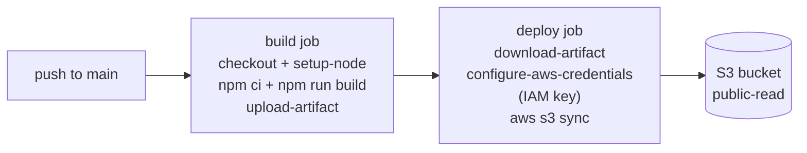

# End-of-POC pipeline

## Stages

1. **push to main** — trigger
2. **build job**
   - checkout + setup-node
   - npm ci + npm run build
   - upload-artifact
3. **deploy job**
   - download-artifact
   - configure-aws-credentials (IAM key)
   - aws s3 sync
4. **S3 bucket** (public-read)
