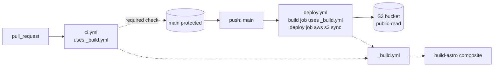

# End-of-Stable pipeline

- `pull_request` triggers `ci.yml` which calls reusable `_build.yml`
- `ci.yml` exposes a `build` status check that branch protection requires before merge to `main`
- Push to protected `main` triggers `deploy.yml` — build job calls `_build.yml`, deploy job runs `aws s3 sync` to public-read S3 bucket
- Both `ci.yml` and `deploy.yml` reuse `_build.yml`, which itself wraps the `build-astro` composite action
